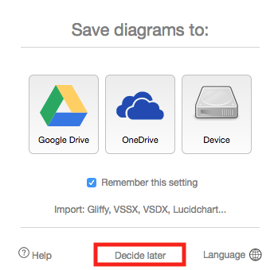
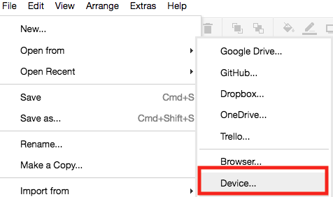

How to use [draw.io](www.draw.io)
======================================

* Go to the website (see link in heading)  
* Click on **Decide later** in the pop-up window  

  
* Click on File -> Open from -> Device  

  
* Select the `template.xml` file from ou
* r Group repository that you cloned  
* Click File -> Save as -> Save it in a file that includes your name.  
* You should be able to edit the diagram now and save it to your device, when your done  
**BUT**  
Save it with a different name! Something like **jussis_ideas.xml** so you don't overwrite the file of someone else.  

I recommend adding the iOS and Android Shapes in draw.io, there are a lot of icons that might be useful.  

